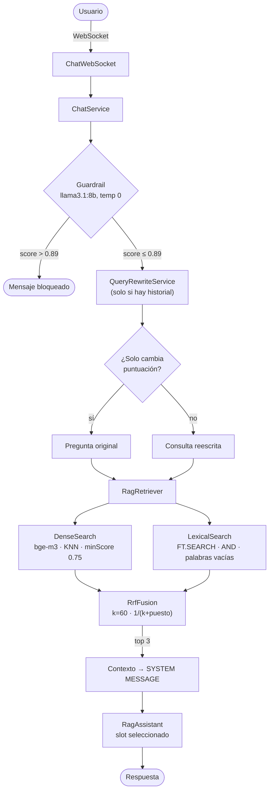
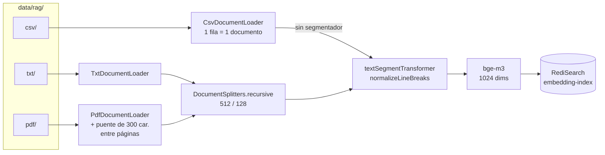

# RAG System — Final Degree Project

Hybrid retrieval-augmented generation system over a local document corpus:
dense vector search (bge-m3 + RediSearch) fused with BM25 lexical search via
Reciprocal Rank Fusion, served through Quarkus and local LLMs on Ollama.

## Arquitectura

### Pipeline de consulta

### Pipeline de ingesta

## Author

Final Degree Project — Alejandro Pisonero
Universidad Pontificia de Salamanca, 2025–2026
